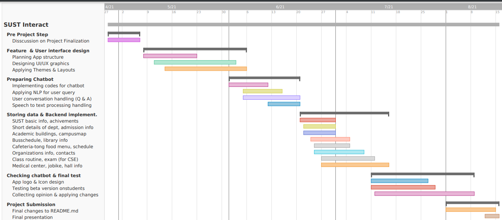

# G30-SUST-Interact

Expected Timeline
-----------------

g

Report on Learning Pre-requisities 
----------------------------------

SL | Learning Task | Description | Status | Comment |
--:|:--------------|:------------|:------:|---------|
1  | Flutter Development | Basics of flutter and its structure |  | Both learning
2  | Dart                | Basics of Dart language for flutter |  | Both learning
2  | Python              | Basics of Python language for AI    |  | Both learning
3  | Firebase            | Backend Implementation for chatbot  |   | Both learning
3  | Android studio      | As IDE tools                        |   | Both learning

